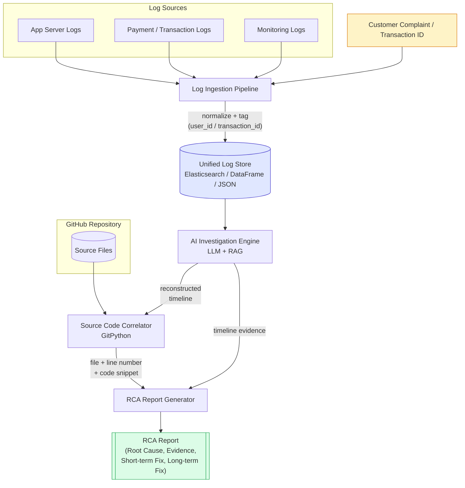
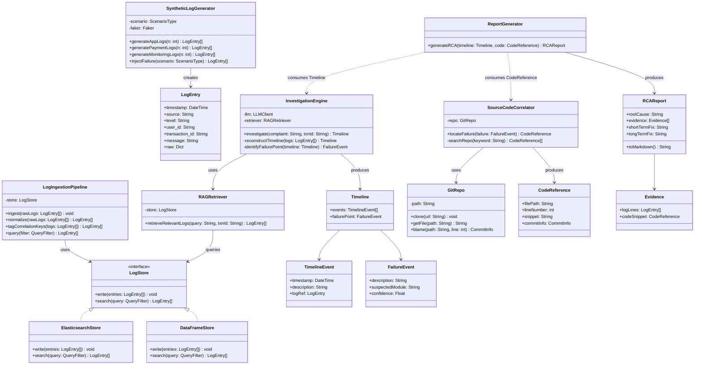
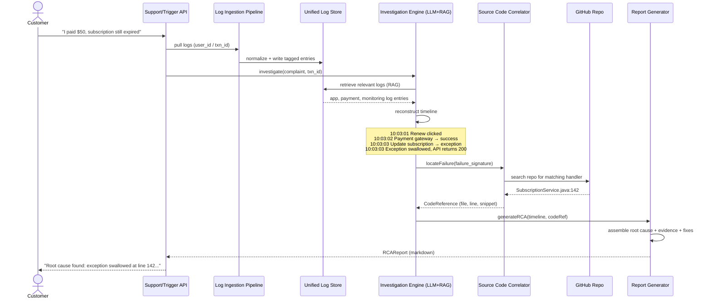

# AI Incident Investigator — Architecture & UML Design

## 1. High-Level System Flow

## 2. UML Component / Class Diagram

## 3. UML Sequence Diagram — Scenario C Walkthrough (Silent Payment Failure)

## Notes on the design

- **Loose coupling via `LogStore` interface** lets you swap Elasticsearch for a simple DataFrame/JSON store during early development (per building block #2) without touching the ingestion or investigation logic.
- **`InvestigationEngine` and `SourceCodeCorrelator` are independent stages** — the engine only needs a `FailureEvent` signature (e.g. exception type, module name, timestamp) to hand off to the correlator, so scenarios A/B/C all flow through the same pipeline shape.
- **`RCAReport.toMarkdown()`** is the natural seam for turning the structured object into the final human-readable report (and could equally emit JSON/HTML for a dashboard).
- Scenarios A and B reuse every box in the flow diagram unchanged — only the `SyntheticLogGenerator.injectFailure()` logic and the shape of `FailureEvent` differ per scenario.
