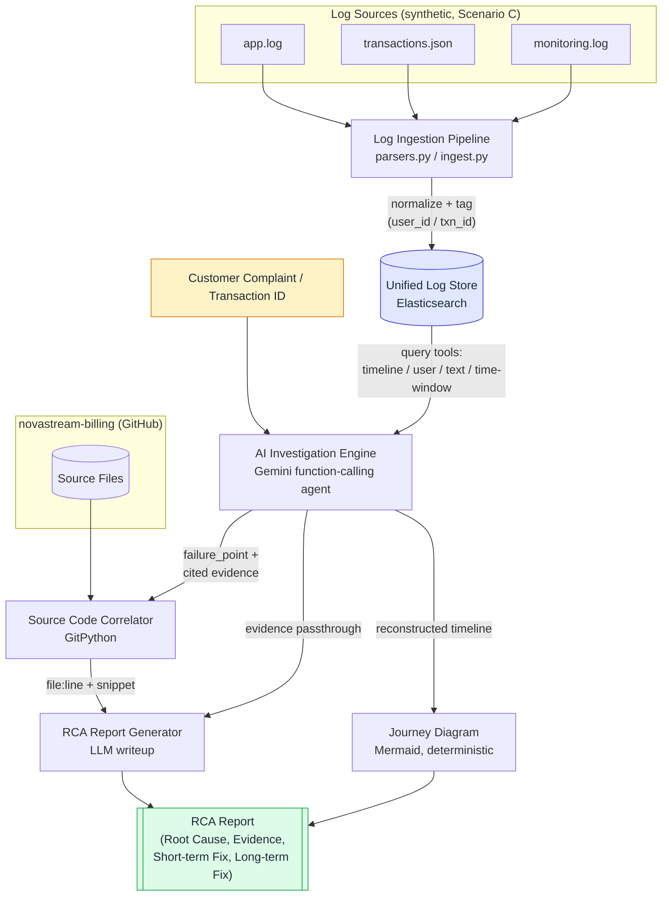
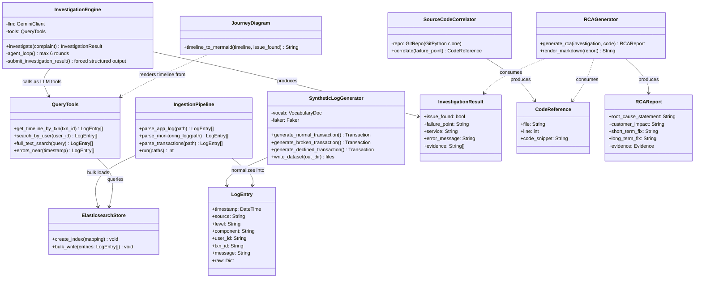
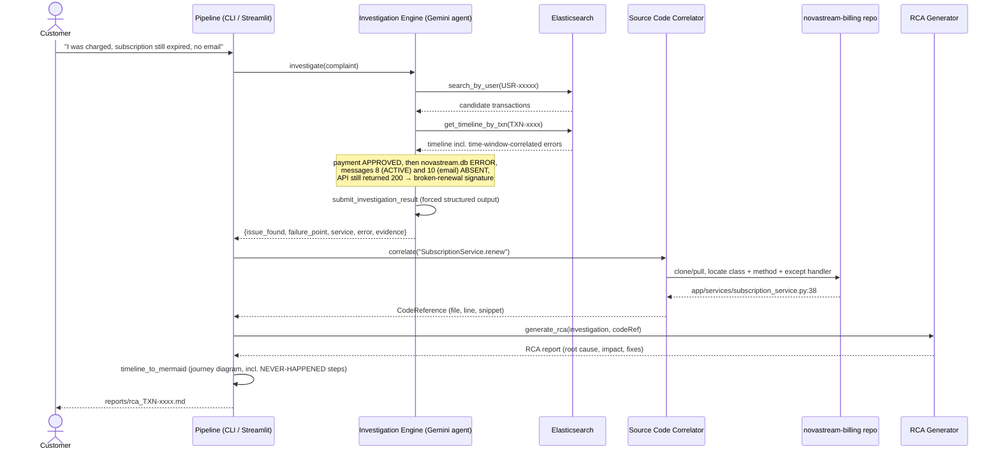

# AI Incident Investigator — Architecture & UML Design

## 1. High-Level System Flow

## 2. UML Component / Class Diagram

## 3. UML Sequence Diagram — Scenario C Walkthrough (Silent Payment Failure)

## Notes on the design

- **The agent decides its own query strategy.** The engine isn't a fixed retrieval pipeline: Gemini chooses which of the four query tools to call, reads the results, and follows the evidence (complaint → user → transaction → timeline). A forced `submit_investigation_result` tool call ends the loop, guaranteeing schema-valid output — including `issue_found: false` for clean transactions, so it doesn't hallucinate failures.
- **Evidence is never LLM-generated.** Log lines pass through verbatim from the store; the code location comes from deterministic GitPython search; the journey diagram is deterministic templating. The LLM writes analysis and fixes, not citations — and the scoring harness (`score.py`) verifies every cited line against the parsed log corpus.
- **`InvestigationEngine` and `SourceCodeCorrelator` are independent stages** — the correlator only needs a `failure_point` string, so scenarios A/B would flow through the same pipeline shape with a different planted bug.
- **Absence as evidence:** the broken-renewal signature is defined by log lines that are *missing* (subscription-ACTIVE, confirmation email). The journey diagram draws those as dashed NEVER-HAPPENED arrows — that's the story of Scenario C in one picture.
