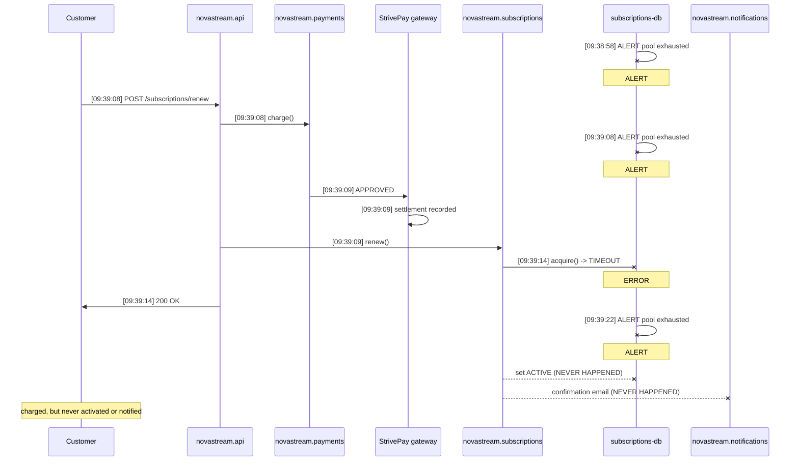

# Root Cause Analysis

## Root cause
The subscription renewal process failed because the database connection pool was exhausted, as evidenced by logs showing a timeout while attempting to acquire a connection. The 'SubscriptionService.renew' method at app/services/subscription_service.py:38 catches and suppresses all exceptions, preventing the system from retrying the failed database operation. Consequently, the subscription state remained out of sync with the payment processing status.

## Customer impact
Affected customers experienced failed subscription renewals where their payment was processed but their account status failed to update to active.

## Evidence
- **Failure point:** `SubscriptionService.renew` (novastream.subscriptions)
- **Error:** None
- **Code location:** `app/services/subscription_service.py:38`

```python
  33                  "Subscription status set to ACTIVE [user: %s, txn: %s]",
  34                  user_id,
  35                  txn_id,
  36              )
  37              self._notifier.send_renewal_confirmation(user_id, txn_id, plan_code)
  38          except Exception:
  39              # TODO(mike): add retry once the pool flakiness is sorted (NOVA-1382)
  40              pass
  41  
  42      def get_status(self, user_id: str) -> Subscription | None:
  43          """Fetch the current subscription row for a user."""
```

### Log evidence
```
2026-07-09 09:39:09,225 INFO [novastream.subscriptions] Renewing subscription [user: USR-95005, plan: PREMIUM_MONTHLY, txn: TXN-0F14D1C5530B]
2026-07-09 09:39:14,226 ERROR [novastream.db] Failed to acquire connection from pool 'subscriptions-db' after 5000ms: pool exhausted (10/10 connections in use)
```

## Short-term fix
Implement an immediate patch to log the suppressed exception at line 38, introduce an automated reconciliation script to identify and update subscriptions for users with successful payments but inactive statuses, and add monitoring alerts for database connection pool exhaustion.

## Long-term fix
Refactor the renewal process to ensure atomicity between the database update and the renewal confirmation notification, potentially by implementing an outbox pattern. This ensures that subscription state updates are persisted reliably regardless of transient database connection pool saturation.

## Transaction journey


